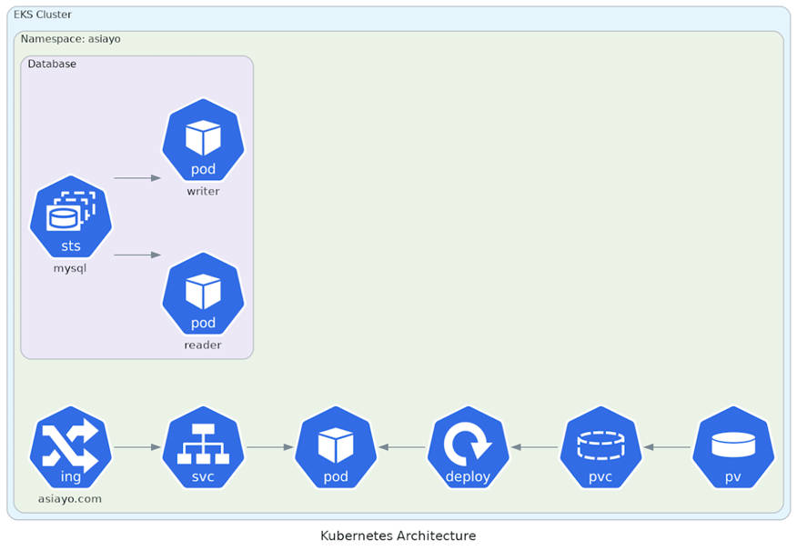

# 題目二

## 題目說明

試想有一服務架構如下，使用 Terraform 建立 AWS EKS Cluster，並透過 Kubernetes manifest 部署應用服務，同時以高可用（High Availability）作為主要設計原則。

---

## 架構圖



---

## 架構設計說明

本架構使用 AWS EKS 作為 Kubernetes 執行環境，並透過 Terraform 管理基礎設施。

流量進入流程：

```
Internet
↓
ALB / Ingress
↓
Service (ClusterIP)
↓
Deployment (Application Pod)
↓
Persistent Volume Claim
↓
Persistent Volume (EBS)
```

資料庫架構：

```

MySQL StatefulSet
├── writer
└── reader

↓

Persistent Storage

```

---

## Terraform

Terraform 用於建立底層雲端資源。

目錄：

```text
terraform/

├── provider.tf
├── main.tf
├── variables.tf
├── outputs.tf
├── network.tf
└── eks.tf

```

部署內容：

- 建立 VPC 與 Subnet
- 建立 Public / Private Network
- 建立 NAT Gateway
- 建立 EKS Cluster
- 建立 Managed Node Group
- 建立 Auto Scaling 機制
- 輸出 Cluster Endpoint 與 VPC 資訊

建立方式：

```
terraform init

terraform plan

terraform apply
```

---

## Kubernetes

Kubernetes Manifest 用於部署應用與資料庫。

目錄：

```text
k8s/

├── namespace.yaml
├── ingress.yaml
├── service.yaml
├── deployment.yaml
├── mysql-statefulset.yaml
├── pvc.yaml
└── hpa.yaml

```

部署內容：

### namespace.yaml

建立獨立 Namespace：

- asiayo

---

### deployment.yaml

部署應用服務：

- replicas=3
- Rolling Update
- 無狀態部署

---

### service.yaml

建立 ClusterIP：

- 提供 Pod 內部流量轉發

---

### ingress.yaml

建立入口：

- ALB Ingress
- Host Routing

---

### mysql-statefulset.yaml

部署資料庫：

- StatefulSet
- 保持資料一致性
- 固定身份識別

---

### pvc.yaml

提供持久化：

- StorageClass：gp3
- 容量：20Gi

---

### hpa.yaml

自動擴容：

- CPU > 70%
- 最少 3 Pods
- 最大 10 Pods

部署方式：

```
kubectl apply -f k8s/
```

---

# 高可用設計（High Availability）

為符合題目要求，以高可用作為主要設計方向：

### 1. Multi AZ

- EKS 部署於多個 Availability Zone
- 降低單點故障風險

---

### 2. NodeGroup Auto Scaling

- Managed Node Group
- 自動增加/縮減 Worker Node

---

### 3. Application Replica

- Deployment replicas=3
- Pod 分散於不同節點

---

### 4. Horizontal Pod Autoscaler

- CPU 使用率超過 70%
- 自動擴充 Pod

---

### 5. Load Balancer

- 使用 AWS ALB
- 自動健康檢查
- 異常 Pod 不導流

---

### 6. Persistent Storage

- 使用 PVC + EBS
- Pod 重建不遺失資料

---

### 7. Database High Availability

- 使用 StatefulSet
- 區分 Reader / Writer

---

### 8. Monitoring & Alert

監控方案：

- CloudWatch
- Prometheus
- Grafana
- Alertmanager

監控內容：

- CPU
- Memory
- Network
- Pod Status
- Error Rate
- Response Time

---

## 驗證方式

查看 Cluster：

```
kubectl get nodes
```

查看服務：

```
kubectl get svc
```

查看 Pod：

```
kubectl get pods -A
```

查看 HPA：

```
kubectl get hpa
```

---

## 設計考量

本設計以：

- 可用性（Availability）
- 可擴展性（Scalability）
- 可維運性（Operability）
- 成本平衡（Cost Optimization）

作為主要目標，符合雲原生應用部署與 DevOps 維運需求。